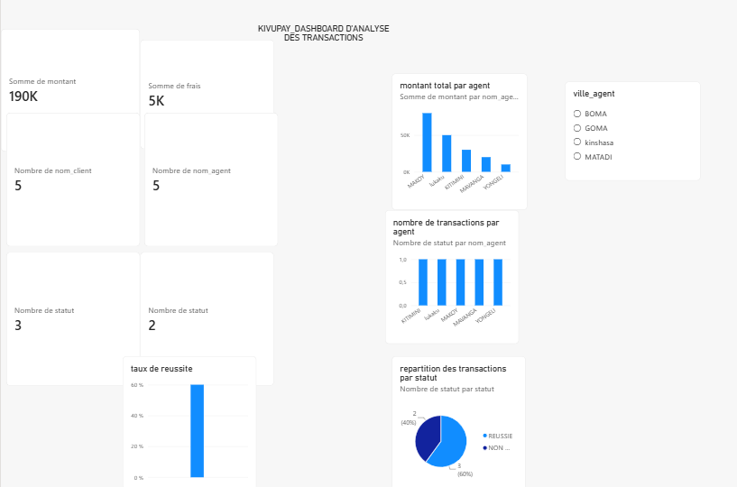

EXAUCE MAKOY

KIVUPAY_ANALYSE DES TRANSACTIONS

Projet_ SQL Server /Excel/Power BI

Présentation 

kivupay est un projet fictif d'analyse de transactions financières digitales en RDC.
l'objectif est d'xploiter des données transactionnelles afin d'identifier les performances, 
les résultats des transactions et les incidents operationnels.

OUTILS UTILISES

SQL Server

Excel

Power BI

TRAVAUX REALISES

analyse et structuration des données avec SQL Server, 
Prepartion et controle des données avec Excel,
creation d'indicateurs de performance,
analyse des transactions non reussie et reussies,
analyse des transactions par agent et par ville,
analyse des motifs d'echec,
analyse des incidents et de leur gravité,
création d'un dashboard interactif avec Power BI.

RESULTATS CLES 

Montant total des transactions :190000

frais totaux :5100

taux de réussite :60%

clients analysés :5

agents analysés: 5

transactions non réussies :2

incidents analysés :5

COMPETENCES MOBILISEES

SQL/EXCEL/POWER BI/analyse de donnée/ finance et reporting/ analyse des operations financieres

NATURE DU PROJET

projet personnel de portfolio destiné a demontrer mes competences pratiques en analyse de données financieres
et en business intelligence.

